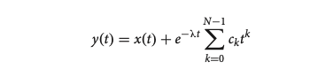
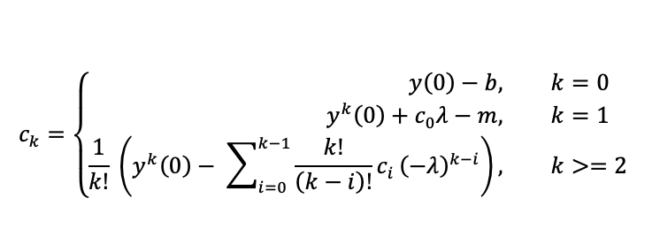
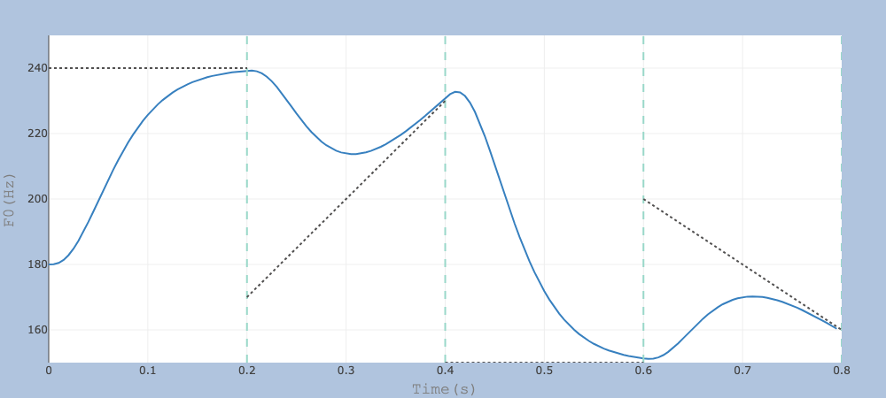

## [A demo webpage for a critically damped nth order system for f0 modelling](http://www.homepages.ucl.ac.uk/~uclyyix/qTA/)
This is a webpage that shows the f0 trajectories generated from a critically damped linear system with varying orders. Plots generated on the webpage are free for downloads.  

The code can model F0 with any order system but the webpage has limited the number to 10 since higher orders might be too taxing on the user's computing power.
#### Equation for target approximation [(Xu & Prom-on, 2019)](https://www.frontiersin.org/articles/10.3389/fpsyg.2019.02469/full):
The linear system  

  
*x(t)* is the linear function driven by the syllable's target, where m and b refer to the slope and height of the target.
  
The coefficients are determined jointly by derivatives of the previous target and the current target parameters.
  
  
Below is a example output of the model:  

  
