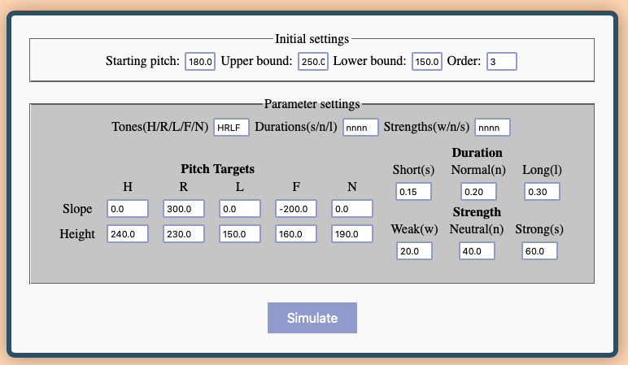

## [A demo webpage for a critically damped nth order system for f0 modelling](http://www.homepages.ucl.ac.uk/~uclyyix/qTA/)
This is a webpage that shows the f0 trajectories generated from a critically damped mass-spring system with varying orders. Plots generated on the webpage are free for downloads.  

The code can model F0 with any order system but the webpage has limited the number to 15. For order highter than 15 the derivative function from the *math* library is used to generate and calculate the higher derivatives so it might take a long time to compute. 

If you wish to compute F0 with higher order systems just comment out or delete the condition block on the 26th line in the get_data.js file.
#### Equation for target approximation [(Xu & Prom-on, 2019)](https://www.frontiersin.org/articles/10.3389/fpsyg.2019.02469/full):
The system  (N denotes the order number)

  
*x(t)* is the linear function driven by the syllable's target, where m and b refer to the slope and height of the target.
  
The coefficients are determined jointly by derivatives of the previous target and the current target parameters.
  

The parameters are specified in the form shown below
  

Below is a example output from the settings above:  

  
